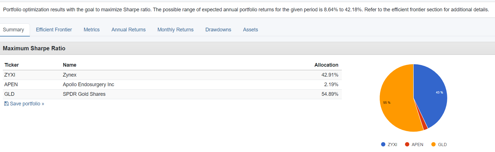

# Group Project Outline
## Our project aims to create a predictive analysis tool that estimates the future value of the US dollar based on certain inputs. We will look to estimate the US dollar based on inputs such as oil prices, government debt, net exports, and R&D. In order to achieve this, the data we choose should reflect the correlation between the identified inputs and exchange rate trends in the past. 

## Possible Sources of Data Include: 

-	API
-	World Bank
-	Asian Development Bank

# Colaborators:
## Emily - imported csvs, did portfolio analysis with Sophie
## Sophie - did Monte Carlo analysis and porfolio analysis with Emily
## Obi - Cleaned data
## Vishnu - Created visualizations 

Our old git hub (linked) https://github.com/emilyblackstein/Group_Project_One had many conflicts and became unreadable. This shows some of our branches but our slack chat is where people shared the code the worked on after the repository crashed. Please also see the screenshot in the images folder.

##   2. Hypothesis

The hypothesis is that the value of the USD index will decrease in the near future based on 4 variables:

Government Debt and investment in R&D:

The US recently lifted the debt ceiling on its $31.4 trillion debt. What this excessive amount of debt means is that more money is spent to pay back interest on debt while less is spent on productive investments like R&D, education, healthcare, which will hurt the economy in the long-run.
Oil:
Oil and USD are negatively correlated because oil is priced using USD. So when the USD is weak it takes more dollars to buy the same amount of oil.
Globalization: 
There’s also a negative correlation between the activity in global trade and the strength of the USD. “Trade activity is strong when the dollar is weak, but global trade su§ers when the dollar is strong” (Bruno &
Song Shin, 2023). This is because exporters borrow money in USD, so when the USD appreciates it’s more expensive for them to trade.
##    3. Correlation 

##   4. Monte Carlo 
 We decided to use the Monte Carlo simulation to identify trends and make predictions on the future value of the USD. The x-axis represents the time period studied from 1971 to 2023, and the y-axis represent sthe %change of the USD index.
First, we made our analysis using average yearly data to eliminate the noise. As you can see from the graph the USD evolves in a 15y cycle: from y10 to y25 it enters into an expansion phase, reaches a peak, and then enters into a contraction. Looking at the far right we can see over the last decade we’ve been in an expansion phase so it’s very likely that we’re currently reaching a peak. As a result, we can predict that the USD will plunge in the next few years, which confirms our first hypothesis.
Lastly, we used the monthly data to make the same model but it shows a more precise analysis. We can see that overall over the last 50 years, despite short-term fluctuations,  the value of the USD has been increasing. 
##   5. Hedging Portfolio 

 The chart shows that “globalization plateaued in the decade and a half since the global financial crisis” (IMF, 2023). This latest era, depicted as an increasingly decentralized global economy, is often called “slowbalization.” In this model, we would have a much less international and less deeply interconnected supply chain model, meaning that trade would focus on regional players (Morgan Stanley). In this context, we would see the emergence of “near-shoring” for value chains. In other words, companies would transfer their production to close-by counterparts to minimize supply chain disruptions. One major player emerging from this regionalization trend is Mexico – thanks to its developed industrial sector, low labour costs, and low tariffs due to trade agreements with the USMCA.
Especially three product industries appear to benefit the most from near-shoring in Mexico: automotive components, consumer electronics, and medical devices. “By relocating to Mexico, certain production lines in these industries may save 15 to 25 percent of total landed cost” (McKinsey Company & Company, 2022).
 
Hence, we have composed a portfolio that would hedge against the risk of “slowbalization” and a devaluation of the USD by first investing in a physical gold ETF (GLD) since the commodity is negatively related to the USD.
 In addition, we have included the top NASDAQ Medical Devices Stocks of 2022 (headquartered in the US).
Zynex (NASDAQ:ZYXI)
Neuronetics (NASDAQ:STIM)
 Apollo Endosurgery (NASDAQ:APEN)
CVRx (NASDAQ:CVRX)
 
Next, we have included Toyota (TM ) since the Mexican government recently announced that it is negotiating with the latter to invest in Southern Mexico.
And finally, we have also added two of the top auto parts stocks listed and headquartered in the US:
-        AEye (Lidr)
-        Commercial Vehicule Group (Cvgi) 
 
##    Portfolio Weight Decision 

##   Limitations: 

The following limits and scope were defined and set for this analysis:

Currency Scope: The analysis was focused on a single Currency - USD
Timeline: Data utilized for the analysis was over a 50 years period; 1971-2023
Variables: Selection of 4 key variable to evaluate correlation to the US dollar index
Visualization: Given the data scope, not all the features of pygwalker was used for visualization

##   Reference: 

Bank for International Settlements. (n.d.). https://www.bis.org/publ/work819.pdf
Hunnicutt, T. (2023, June 5). Biden signs debt limit bill, avoiding U.S. default. Reuters. https://www.reuters.com/world/us/biden-signs-bill-lifting-us-debt-limit-2023-06-03/
Kenton, W. (2023, May 26). What is the crowding out effect economic theory?. Investopedia. https://www.investopedia.com/terms/c/crowdingouteffect.asp
Lioudis, N. (2022, November 10). How the balance of trade affects currency exchange rates. Investopedia. https://www.investopedia.com/ask/answers/041515/how-does-balance-trade-impact-currency-exchange-rates.asp
Online, F. T. (n.d.). The correlation between US dollar, Gold & Oil and how to profit from it. LinkedIn. https://www.linkedin.com/pulse/correlation-between-us-dollar-gold-oil-how-profit/
Smith, K. (2022, July 13). How gold affects currencies. Investopedia. https://www.investopedia.com/articles/forex/11/golds-effect-currencies.asp 

##   Data Source 

[US Dollar Index] (https://www.investing.com/indices/usdollar-historical-data)
[US National Debt] (https://www.thebalancemoney.com/national-debt-by-year-compared-to-gdp-and-major-events-3306287)
[US Research and Dev] (https://www.aaas.org/programs/r-d-budget-and-policy/historical-trends-federal-rd)
[Oil Price] (OPEC crude oil price statistics annually 1960-2023 | Statista)
[US Globalization] (https://data.worldbank.org/indicator/NE.TRD.GNFS.ZS)